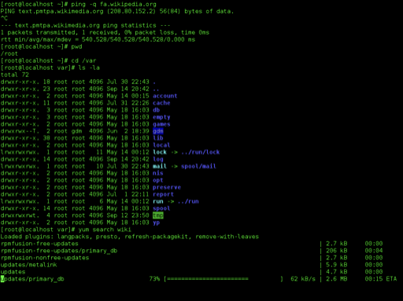
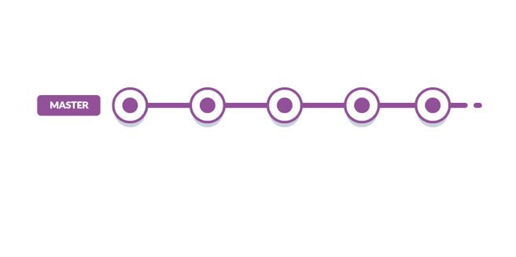
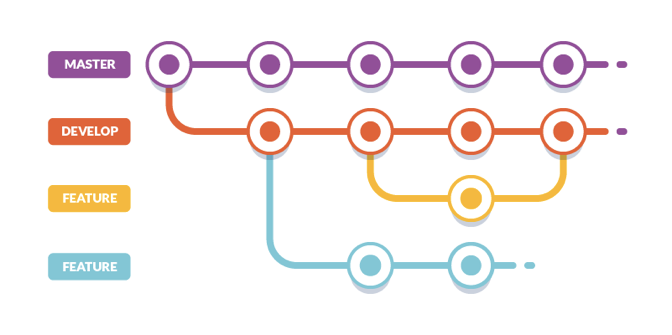
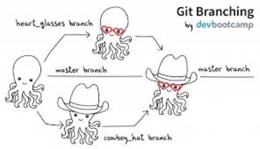
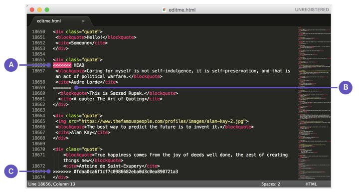

# Git, GitHub e linha de comando

* [O que é Git?](#o-que-é-git)
* [Por que o Git é importante?](#por-que-o-git-é-importante)
* [O que é GitHub?](#o-que-é-github)
* [Por que o GitHub é importante?](#por-que-o-github-é-importante)
* [O que é linha de comando?](#o-que-é-linha-de-comando)
* [Por que a linha de comando é importante?](#por-que-a-linha-de-comando-é-importante)
* [O que é GitHub Desktop?](#o-que-é-github-desktop)
* [Por que o GitHub Desktop é importante?](#por-que-o-github-desktop-é-importante)
* [Comandos básicos do terminal](#comandos-basicos-do-terminal)
* [Começando com o Git](#comecando-com-o-git)
* [Fluxo do git](#fluxo-do-git)
* [Instalando/verificando se o Git está instalado](#instalandoverificando-se-o-git-está-instalado)
* [Formas de trabalhar com o Git/GitHub](#formas-de-trabalhar-com-o-gitgithub)
* [Pra não esquecer:](#pra-nao-esquecer)
* [GitHub Pages](#github-pages)
* [Branch](#branch)
* [Merge](#merge)
* [Fork](#fork)
* [Pull request](#pull-request)
* [Links com mais conteúdo para consulta](#links-com-mais-conteúdo-para-consulta)

***

### O que é Git?


É um programa open source de controle de versão de código, criado pelo mesmo desenvolvedor do Linux.
Com o GIT podemos desenvolver projetos colaborativos, onde outras pessoas podem trabalhar simultaneamente no mesmo código sem riscos de perdermos nada do nosso trabalho.
Com o Git também conseguimos ter um histórico de tudo que foi alterado nos arquivos ao longo do tempo, além de mostrar quem foi o autor da mudança.
Se formos utilizar um exemplo para exemplificar o Git, podemos dizer que ele usa a mesma lógica do Google Drive. Várias pessoas trabalando simultaneamente no mesmo arquivo, adicionando e removendo conteúdos, além de termos a opção de consultar o histórico do que e quando foi modificado.

***

### Por que o Git é importante?

* Organização: O Git cria uma timeline com tudo que aconteceu desde o início do projeto. Tudo que foi adicionado, removido, e quem foi o autor.
* Projetos com várias pessoas: Evita o “final_valendo_valendo2_oficial”. Tamém facilita o trabalho em equipe (entender o que foi feito, onde parou, quem fez o que).
* Segurança:  Se algo der errado, você pode resgatar uma versão anterior, além  de ter o seu projeto salvo em um lugar seguro.

***

### O que é GitHub?


É uma espécie de rede social muito utilizada principalmente por desenvolvedores, onde você pode publicar e compartilhar todos os seus projetos pessoais e particulares, além de colaborar com projetos de pessoas e empresas de todo o mundo.
É uma forma mais visual de trabalhar com o Git, pois possui uma interface gráfica e também apps para desktop.
Você pode salvar todos seus projetos de forma pública no seu perfil (qualquer pessoa, mesmo sem ter uma conta pode ver e baixar tudo o que você publicar), e de forma privada (somente membros com permissão de acesso podem visualizar ou baixar seu projeto) a partir de $7/m.
O GitHub é uma startup americana e recentemente foi adquirido por $7.5 bilhões (isso mesmo, [bilhões](https://techcrunch.com/2018/06/04/microsoft-has-acquired-github-for-7-5b-in-microsoft-stock/)) pela Microsoft.

Resumidamente: Você trabalha na sua máquina e salva versões do seu código no GitHub, e também pode baixar cópias do código que está hospedado GitHub para a sua máquina.

***

### Por que o GitHub é importante?
* Portfólio - É um site seguro para guardar e mostrar seus projetos. Não é incomum as empresas pedirem apenas seu GitHub antes de uma entrevista de emprego.
* Organização - Permite que todo mundo trabalhe no mesmo projeto (seja um projeto da sua empresa ou um Open Source).
* Ferramentas - Porque oferece funcionalidades extras ao git, como interface visual, documentação, bug tracking, feature requests, pull requests, etc.
* Versatilidade: Você pode guardar qualquer tipo de arquivo no git/Github, não necessariamente código. Por exemplo, essa aula que estamos vendo. O Github utiliza uma linguagem chamada [Markdown](https://github.com/adam-p/markdown-here/wiki/Markdown-Cheatsheet), que permite criar listas, links, ancôras, adicionar imagens, vídeos, gifs...

***

### O que é linha de comando?


É aquela tela preta que aparece nos filmes, normalmente com alguém hackeando algum sistema.
Mexer com o terminal assusta um pouco porque ele não é nem um pouco visual. Mas é muito simples mexer nele.
Sabe quando a gente arrasta arquivos para uma pasta ou cria uma pasta nova? No terminal você faz tudo isso também, mas sem interface gráfica. A gente insere comandos, e ele executa.

### Por que a linha de comando é importante?

Na linha de comando você controla melhor o que está rolando com o seu computador - inclusive o versionamento. O git é sempre usado através de linha de comando. (O GitHub tem ferramentas visuais para uso do Git, mas é importante saber se virar pela linha de comando)

***

### O que é GitHub Desktop?
É uma ferramenta visual para utilizar o Git/GitHub diretamente no seu computador. Você pode baixar uma cópia gratuita na sua máquina e utilizar todos os comandos do Git sem a linha de comando.

### Por que o GitHub Desktop é importante?
Por ter uma interface visual, a curva de aprendizado do Git com essa ferramenta é menor. Ela também faz com quem está iniciando se sinta mais seguro ao trabalhar com o Git. Porém é importante aprender bem como o Git funciona e utiliza-la como ferramenta de apoio.

***

### Comandos básicos do terminal

Esses comandos servem para para listar arquivos e navegar entre pastas dentro do computador.

```
ls - LISTAR (ele traz uma lista de tudo o que está naquela pasta - documentos, outras pastas, etc)

pwd - Present working directory (onde estou?) Ele traz todo o caminho onde você está (em que pasta e onde essa pasta fica)
cd - change directory (use para se locomover entre as pastas)
cd ~ - volta para a raiz
cd . - volta uma pasta acima
cd nome-da-pasta - para entrar em uma pasta (você precisa conseguir enxergar ela quando listar os arquivos)
whoami - "quem sou eu?" identifica o usuário que está mexendo no sistema.
```

***

### Começando com o Git

Algumas palavras novas que vamos usar com o Git/GitHub

* Repositório: É um espaço digital aonde o seu projeto vai ser salvo. No seu computador ele é a pasta aonde o seu projeto está salvo.

* Controle de versão: É a proposta básica do Git, um histórico de tudo o que aconteceu com o(s) arquivo(s) que você está trabalhando. Por exemplo, quando você salva um arquivo do Word no seu computador, você perde todas as versões anteriores, ficando somente com o conteúdo atual. Com o Git você tem todas as versões antigas dos arquivos.

* Commit: Quando você faz um commit com o Git, você está criando um controle de versão (histórico) daquele arquivo e criando uma etiqueta para facilitar o entendimento do que foi salvo naquele momento.

* Pull: O pull serve para se comunicar entre a sua máquina e o repositório remoto. Esse comando faz uma cópia do repositório remoto e baixa ele para a sua máquina.

* Push: O push também serve para se comunicar entre a sua máquina e o repositório remoto. Esse comando faz uma cópia do repositório local e envia ele para o repositório remoto.

* Clone: O comando clone faz exatamente o que ele sugere: uma cópia exata do arquivo, que você vai baixar do repositório remoto para a sua máquina.

***

### Fluxo do git


Tudo isso está acontecendo apenas localmente no seu computador!

Cada etiqueta vai gerando um ponto na nossa timeline. Essa etiqueta se chama commit, e com essa pequena descrição fica mais fácil se achar entre as versões.


***

### Instalando/verificando se o Git está instalado

Digite git status na linha de comando, e várias instruções e sugestões do git devem aparecer.

Comandos para usar uma vez na vida: (assim o git sabe quem está fazendo as alterações)


```
git config --global user.name “Patricia Tonella"

git config --global user.email “patricia.tonella@gmail.com”
```

Para remover o usuário
```
git config --global --unset-all user.name "Patricia Tonella"
git config --global --unset-all user.email “patricia.tonella@gmail.com”
```

***

### Formas de trabalhar com o Git/GitHub

1) Baixar um projeto que está hospedado no GitHub para a nossa máquina

2) Iniciar um projeto novo na minha máquina e subir para o GitHub

***

#### Baixar um projeto que está hospedado no GitHub para a nossa máquina

1) Acessar o GitHub e criar uma conta gratuita.
*Importante:* utilizar um nome de usuário fácil de usar, pois essa url vai ser muito utilizada durante a vida profissional.

2) Acessar https://github.com/ptonella
3) Acessar o repositório `github`
4) Clicar no botão `Clone or download` e copiar a url https
4) Navegar até a pasta aonde você vai fazer o clone do projeto
5) git clone url-que-vocês-copiaram

***

#### Iniciar um projeto local e subir pro GitHub

1) Navegar pela linha de comando até a pasta desejada
2) Rodar o comando  git status. Provavelmente o Git não vai estar iniciado nessa pasta, então vamos rodar um comando para avisar para o Git começar a versionar essa pasta: `git init`
4) Criar um repositório no GitHub (colocar o nome do projeto de vocês)
5) Copiar a url do repositório (igual vocês fizeram no exemplo anterior)
6) `git add .` (para adicionar todos os arquivos de uma vez) ou `git add caminho-do-arquivo`
git `commit -m "Aqui você escreve uma mensagem que ajude quem estiver lendo a saber o que você adicionou/modificou nos arquivos"`
7) `git remote add origin url-que-voces-copiaram-do-github`
8) `git remote -v` (vai mostrar as urls, provavelmente duas)
9) `git push origin master`

Abrir o repositório no GitHub. Os arquivos que estavam na máquina de vocês agora devem estar salvos no GitHub 🎉
Agora uma cópia do trabalho de vocês até agora está salvo no GitHub, e o Git está monitorando essa pasta.
A partir de agora, sempre que vocês modficarem/adicionarem/removerem arquivos nessa pasta, o Git vai saber e  vai mostrar tudo o que foi modificado/adicionado/removido.

***

### Pra não esquecer:
(comandos que mais vamos usar)
* `git status` (para ver a lista de arquivos modificados)
* `git add .` (para adicionar todos os arquivos de uma vez) ou git add caminho-do-arquivo
* `git commit -m "Mensagem"` (cria um histórico daquele arquivo com uma etiqueta explicando o que foi feito)
* `git pull origin master` (o comando PULL pega a versão do arquivo que está no repositório remoto e baixa para sua máquina.
* `git push origin master` (envia as modificações para o repositório remoto)

*Importante:* Fazer um `pull` sempre antes do `push` para evitar conflitos e evitar apagar alguma informação remota

***

### GitHub Pages
Quem tem uma conta no GitHub pode ter acesso a uma hospedagem gratuita para os projetos que estão com o código hospedado no GitHub.

1) Criar um repositório no GitHub: username.github.io (username deve ser o seu username do GitHub)
2) Clonar repositório na sua máquina
3) Add arquivos
4) Fazer o commit
5) Push para o GitHub
6) Acessar https://username.github.io

***

### Branch
O git tem uma linha do tempo principal chamada master, que é branch base criada junto com cada repositório. Quando trabalhamos sozinhas em um repositório não tem problema trabalharmos sempre no master, mas quando começamos a trabalhar com outras pessoas em um projeto, surge a necessidade de ter uma cópia do projeto que seja livre de bugs e que esteja funcionando 100%. Essa cópia é o master.

A partir do código que está no master podemos gerar outras cópias para serem modificadas e depois devolvidas para o master.

Essas cópias são chamadas de branch.





Comando para criar um novo branch:
`git checkout -b nome-do-branch`

Comando para trocar de branch:
`git checkout nome-do-branch`

Comando para listar todos os branches locais:
`git branch`

***

### Merge

Depois de criar um branch e fazer alterações no código, você precisa devolver essa sua cópia para o master. Você faz isso com o comando merge.

Merge é mesclar um branch dentro de outro, juntando as alterações que já estavam no código do branch base com as alterações do outro branch.




Se duas ou mais pessoas mexerem no mesmo arquivo simultaneamente, isso pode gerar conflito de código.
O Git consegue resolver alguns desses conflitos automaticamente, mas em outros casos o desenvolvedor que está fazendo o merge tem que resolver esse conflito e depois continuar com o merge.




Comando para fazer merge de um branch em outro:

`git merge nome-do-branch-que-vai-ser-mergeado`

*Importante:* Quando você rodar esse comando, o merge do nome-do-branch-que-vai-ser-mergeado vai ser feito com o branch em que você está no momento

Pra saber em qual branch você está: `git status`

***

### Fork

Um fork é uma cópia de um projeto de outra pessoa dentro do seu GitHub. É como quando você faz o clone de um repositório do seu GitHub pra sua máquina.

Normalmente você faz um fork de um projeto para fazer melhorias no código. Depois das melhorias feitas, você vai abrir um pull request para o dono do repositório, e se suas modificações forem aceitas, seu código vai ser 'mergeado' no código original.

https://github.com/octocat/Spoon-Knife
https://github.com/octocat/Spoon-Knife/pulls

***

### Pull request

Quando você faz um fork de um projeto, ou quando você trabalha em uma empresa com mais desenvolvedores, é normal que as demais pessoas envolvidas no projeto façam um review do seu código antes de ele ir pro master, afinal você pode ter cometido algum erro no desenvolvimento, ou alguma parte do seu código pode ser melhorada.

Um pull request é quando você quer fazer merge do seu código em outro branch, mas você precisa da autorização das outras pessoas envolvidas no projeto.

***

### Links com mais conteúdo para consulta

Git e Github (textos e vídeos): https://guides.github.com/activities/hello-world/
Curso Gratuito - https://www.udemy.com/git-e-github-para-iniciantes/
Live Mastertech “Guia Completo de Git” - https://www.youtube.com/watch?v=BWjcsuxFUmQ
Live Mastertech “Github na prática” - https://www.youtube.com/watch?v=pcNX1VqC8Po
Tutorial Code School - https://www.codeschool.com/courses/try-git
